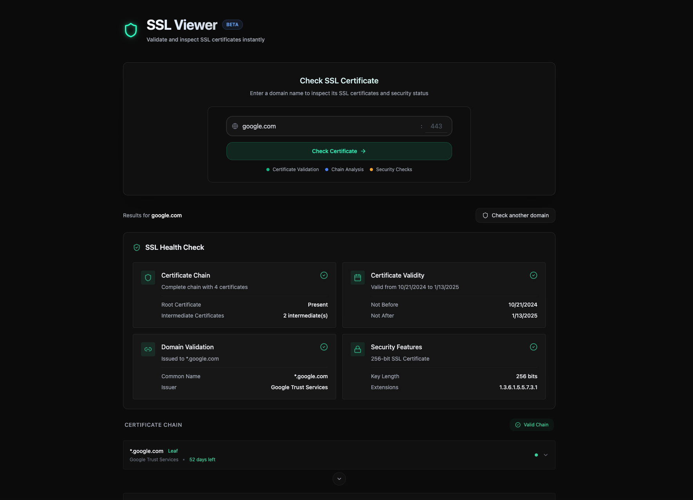

# SSLViewer

A modern, user-friendly SSL certificate analysis tool built with React and TypeScript. SSLViewer allows you to quickly inspect and validate SSL certificates for any domain.

The entire front-end codebase was written by [Claude 3.5 Sonnet](https://www.anthropic.com/claude) using [Windsurf IDE](https://www.codeium.com/windsurf), a revolutionary AI-powered development environment.


## Features

- Real-time SSL certificate validation
- Complete certificate chain visualization
- Fast and responsive interface
- Detailed certificate information display
- Comprehensive validation checks
- Modern, clean UI with dark mode
- Mobile-responsive design

## Tech Stack

- React 18
- TypeScript
- Tailwind CSS
- Framer Motion
- Vite

## Getting Started

### Prerequisites

- Node.js (v16 or higher)
- npm or yarn

### Installation

1. Clone the repository
```bash
git clone https://github.com/bgf0007/SSLViewer.git
cd SSLViewer
```

2. Install dependencies
```bash
npm install
# or
yarn install
```

3. Start the development server
```bash
npm run dev
# or
yarn dev
```

4. Open [http://localhost:5173](http://localhost:5173) in your browser or visit the offical website at [https://www.sslviewer.com](https://www.sslviewer.com)

## Usage

1. Enter a domain name in the input field
2. Click "Check SSL" or press Enter
3. View the detailed certificate information and validation results
4. Explore the certificate chain and raw certificate data

## License

This project is licensed under the MIT License - see the [LICENSE](LICENSE) file for details.

## Acknowledgments

- [OpenSSL](https://www.openssl.org/) for SSL/TLS toolkit
- [React](https://reactjs.org/) for the UI framework
- [Tailwind CSS](https://tailwindcss.com/) for styling
- [Framer Motion](https://www.framer.com/motion/) for animations
- [Claude 3.5 Sonnet](https://www.anthropic.com/claude) for generating the entire front-end codebase
- [Windsurf IDE](https://www.codeium.com/windsurf) for the AI-powered development environment
- [Vercel](https://vercel.com) for hosting and deployment

## Contact

[@bgf0007](https://github.com/BGF0007)
